# LAPORAN PRATIKUM 2

## PROGRAM PEMESANAN TIKET BIOSKOP
### KODE PEMROGRAMAN 
Pada tahap awal terdapat Variabel tipe_tiket. Kode ini meminta pengguna untuk memasukan tipe tiketnya, apakah "reguler" atau "VIP". Hasil input ini akan disimpan di variabel tipe_tiket. Selain variabel tipe_tiket terdapat variabel status_member, kode ini meminta pengguna mengenai status member mereka, Apakah Anda memiliki status member "YA" Atau "TIDAK". Hasil input ini akan disimpan di variabel status_member 

### TAHAP KEDUA
Pada tahap ini,menggunakan struktur if-else untuk menentukan harga tiket berdasarkan tipe tiket. Di Tahap ini terdapat tiga kemungkinan yang pertama. Jika tipe_tiket adalah "reguler", maka variabel harga diatur menjadi 50.000 (harga tiket reguler). Kemungkinan yang kedua jika tipe_tiket adalah "vip", maka variabel harga diatur menjadi 100.000 (harga tiket VIP). Dan kemungkinan yang ketiga yaitu jika pengguna memasukkan tipe tiket selain "reguler" atau "vip", harga diatur menjadi 0, dan pesan "Tipe tiket tidak valid." akan ditampilkan. Ini juga berfungsi sebagai validasi tipe tiket yang dimasukkan pengguna. 

### TAHAP KETIGA
Pada tahap ini memastikan bahwa proses akan berlanjut apabila tipe tiket valid(harga tidak 0). Jika Harga 0 karena tipe tiket tidak valid maka program akan melewati blok ini dan tidak akan menghitung harga akhir dan mencetak hasil. 

### TAHAP KEEMPAT 
Pada bagian ini operator ternary digunakan untuk menghitung harga akhir berdasarkan status member :
Jika status member "ya" maka pengguna yang memiliki kartu akan mendapat diskon 20%
Namun jika Status member "tidak" maka tidak ada potongan harga.
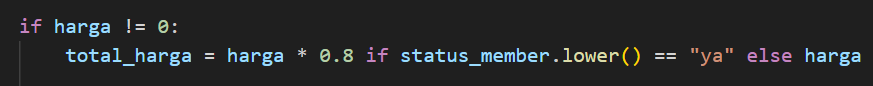

### TAHAP KELIMA
Pada bagian ini akan menampilkan hasil akhir 
tipe-tiket = jenis tiket yang dipilih
status_member = Status member pengguna
total_harga = harga yang harus dibayar
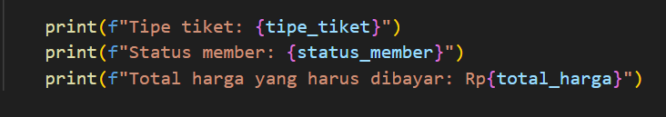

## CONTOH 
### Kasus 1 : Memilih tiket reguler dan mempunyai kartu member
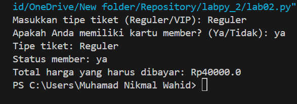

### Kasus 2 : Memilih tiket reguler dan tidak mempunyai kartu member
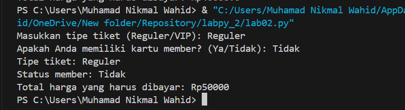

### Kasus 3 : Memilih tiket VIP dan mempunyai kartu member 
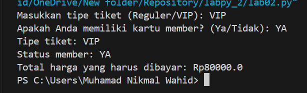

### Kasus 4 : Memilih tiket VIP dan tidak mempunyai kartu member 
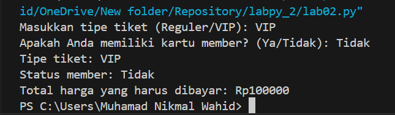

### Kasus 5 : Pengguna memasukkan tipe tiket yang tidak valid
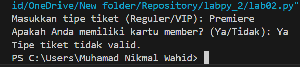

## FLOWCHART 
### TAHAP AWAL 
Untuk memulai Flowchart gunakan terminator sebagai penanda awal flowchart. Setelah itu masuk ke tahap input program menggunakan bentuk paralelogram. Input yang pertama yang di gunakan untuk tipe_tiket sedangkan input yang kedua digunakan untuk mengetahui status member pengunjung.
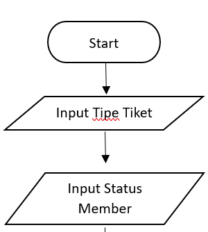

### TAHAP KEDUA
Pada tahap ini pengambilan keputusan pertama dilakukan yaitu mengenai tipe tiket di flowchart tersebut ditulis "Tipe Tiket == reguler?", disini terdapat dua keputusan yaitu ya dan tidak. Jika ya maka tiket tersebut adalah reguler dan jika tidak maka tiket tersebut adalah VIP. Setelah keputusan pertama selesai maka akan lanjut keputusan ke-2 yaitu mengenai status member, jika status member tersebut adalah "ya" maka akan mendapat potongan harga. Jika "Tidak" maka tidak akan mendapat potongan harga. 

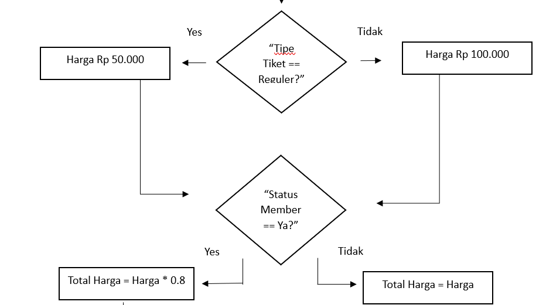

### TAHAP AKHIR 
Output akan menampilkan program yang harus dibayar dan progam akan berakhir 
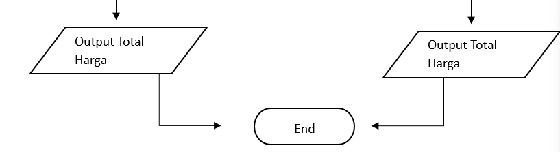

## GAMBAR FLOWCHART KASUS 1
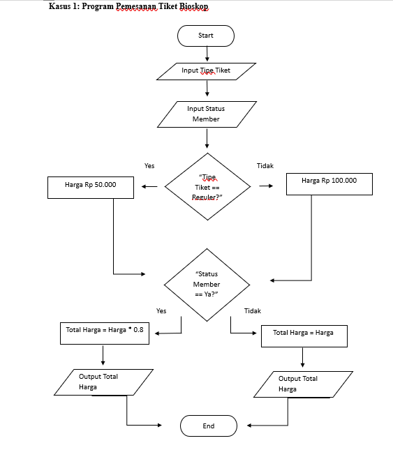

# KASUS 2 PROGRAM KALKULATOR SEDERHANA 
## KODE PEMROGRAMAN 
### TAHAP AWAL 
Pada tahap awal terdapat 2 fungsi input, fungsi meminta pengguna untuk memasukan angka pertama dan angka kedua. Selain fungsi input terdapat fungsi agar dapat melakukan operasi angka desimal. 

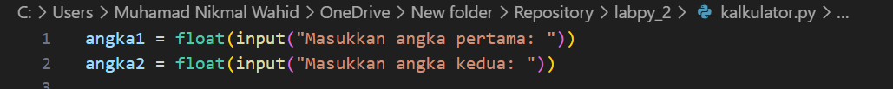

### TAHAP KEDUA 
Disini pengguna diminta untuk memasukkan operator aritmatika yang ingin digunakan. Operator yang valid adalah +, -, *, /. 

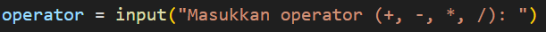

### TAHAP KETIGA
Di tahap ini terdapat strukur if. Jika Operator adalah "+" maka akan progam akan menjumlahkan angka1 dan angka2 dan menyimpan hasilnya di variabel hasil. Jika operator adalah "-" maka program akan mengurangi angka 2 dari angka 1 . Jika operator adalah "*" program akan mengalikan angka1 dengan angka2. Jika operator adalah "/", program memeriksa apakah angka2 adalah nol. Pembagian dengan nol tidak valid, sehingga jika angka2 sama dengan nol, hasil akan diisi dengan pesan error. Jika tidak, program melakukan pembagian angka1 dengan angka2. 

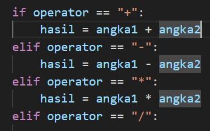

### TAHAP KEEMPAT 
Jika operator yang dimasukkan tidak sesuai dari keempat operator di atas maka hasil akan diisi dengan pesan error. 

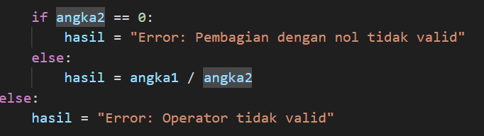

### TAHAP KELIMA 
Menampilkan hasil 

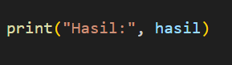

## CONTOH 
### Hasil ekseskusi apabila valid 
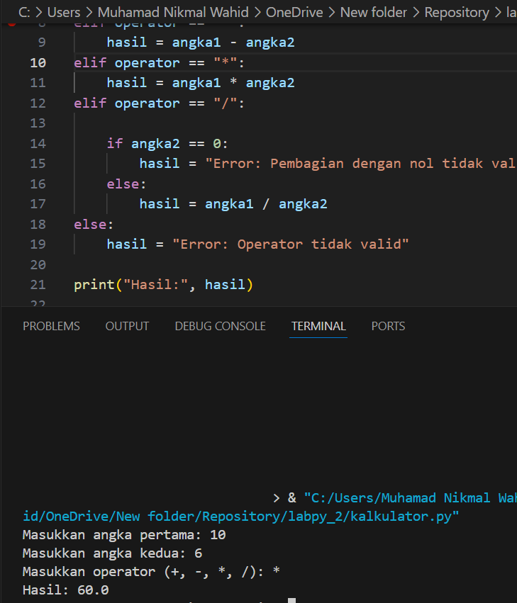

### Hasil eksekusi apabila Error
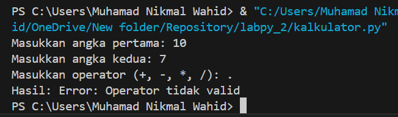

# FLOWCHART KASUS 2 
### TAHAP AWAL 
Mulai Program dengan bentuk Terminator sebagai penanda awal program 

### TAHAP KEDUA
Pada tahap ini gunakan bentuk Paralelogram dan terdapat input angka pertama, kedua dan input operator. 

### TAHAP KETIGA 
Pada Tahap ketiga keputusan operator di tentukan apakah +, -, *, atau /. Namun pada operator pembagian terdapat keputusan yaitu apabila angka kedua = 0 maka program akan terjadi error tetapi jika angka kedua tidak 0 maka program tidak error atau menampilkan hasil. 

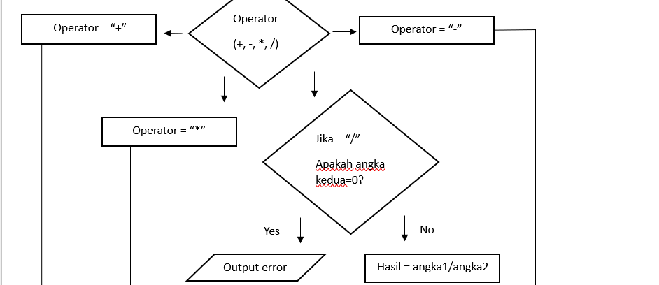

### TAHAP AKHIR 
Hasil dari operasi dan program akan berakhir 

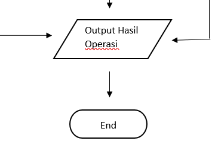

