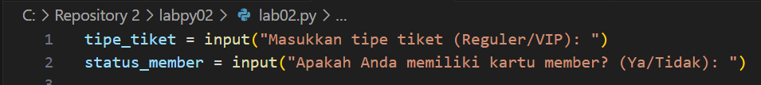
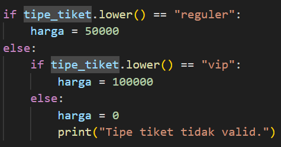

# LAPORAN PRATIKUM 2

## PROGRAM PEMESANAN TIKET BIOSKOP
### KODE PEMROGRAMAN 
Pada tahap awal terdapat Variabel tipe_tiket. Kode ini meminta pengguna untuk memasukan tipe tiketnya, apakah "reguler" atau "VIP". Hasil input ini akan disimpan di variabel tipe_tiket. Selain variabel tipe_tiket terdapat variabel status_member, kode ini meminta pengguna mengenai status member mereka, Apakah Anda memiliki status member "YA" Atau "TIDAK". Hasil input ini akan disimpan di variabel status_member 

### TAHAP KEDUA
Pada tahap ini,menggunakan struktur if-else untuk menentukan harga tiket berdasarkan tipe tiket. Di Tahap ini terdapat tiga kemungkinan yang pertama. Jika tipe_tiket adalah "reguler", maka variabel harga diatur menjadi 50.000 (harga tiket reguler). Kemungkinan yang kedua jika tipe_tiket adalah "vip", maka variabel harga diatur menjadi 100.000 (harga tiket VIP). Dan kemungkinan yang ketiga yaitu jika pengguna memasukkan tipe tiket selain "reguler" atau "vip", harga diatur menjadi 0, dan pesan "Tipe tiket tidak valid." akan ditampilkan. Ini juga berfungsi sebagai validasi tipe tiket yang dimasukkan pengguna. 

